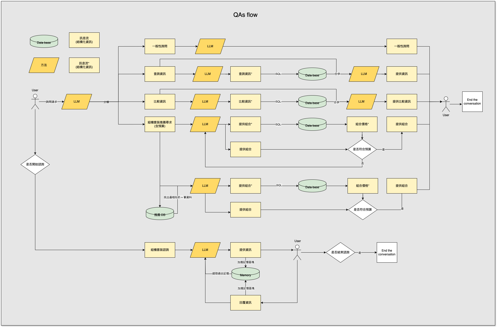

# 🧑‍💻 DIY PC BuildMate 

DIY PC BuildMate is an open-source for everyone who wants to build the PC-recommended chatbot. This chatbot designed to assist in the decision-making process of purchasing individual components for DIY PC builds. This project showcases a practical application of Large Language Model (LLM) technologies, employing strategies such as In-context Learning, Retrieval-Augmented Generation (RAG), fine-tuning, and advanced prompt engineering. Tailored to simplify the PC component shopping experience, it offers valuable guidance and recommendations, making the selection process easier and more accessible for both beginners and seasoned PC enthusiasts. DIY PC BuildMate aims to demystify the complexity of choosing the right parts for your custom PC build, ensuring a more informed and personalized shopping journey.

- ✅ QA for PC general knowledge 
- ✅ Search for any information in a database already.
- ✅ Recommend a list of PC components.

## Repository architecture
```
diy_pc_buildmate/
├── app.py
├── chainlit.md
├── chains.py
├── prompt.py
├── units.py
└── data/
    └── General_QAs.json
    └── ...
└── config/
    └── app_config.json
    └── ...
└── crawler/
└── wiki_chain/
└── evaluation/
└── build_database/
└── build_dataset/
└── report/
```

## Installation

The Python version: 3.10.13

Open a terminal and run:

```bash
$ pip install -r requirements.txt
```


## 🚀 Quickstart
You can run diy_pc_buildmate website to ask any question about PC.

```
$ chainlit run app.py
```

## 👩‍🔬 Evaluation 
Test the QA with a test dataset.
```
$ python evaluation/evaluation.py --config_path config/evaluation_config.json
```
Build a config if you want to try another dataset, DB, or RAG.

## 🤖 Build RAG or DB
Is the LLM model not powerful? Feed more data to improve its performance!
```
$ python build_database/build_database.py --database_path data/few_db.db
$ python build_database/build_rag.py --rag_path data/few_rag.json
```

After you build a new RAG and DB, you want to test them. You need to place the path to config/few_config.json

1. Find the GPTs -> Retrieve -> database_path and replace the path to data/few_rag.json 

2. Find the GPTs -> SQL -> database_path and replace the path to data/few_db.json 

## 📂 Build a new dataset
If you want to test your dataset from scratch. Just review the code below.
```
$ python build_dataset/build_few_dataset.py --test_dataset_path data/few_dataset.json
```

After you build a new dataset and want to test it. You should place the path to few_config.json
```json
# config file
"test_dataset_path": "data/few_dataset.json"
```
Finally, run the test code with a few datasets.
```
$ python evaluation/evaluation.py --config config/few_config.json
```
After a few seconds, you can see the result on the screen. It means you ran the whole process successfully!

## 👨🏻‍💼 The service flow



## 🐍 Build the dataset with Crawler

- Crawl [Mobile01](mobile01.com) website 👉 [crawler/mobile01](crawler/mobile01) 

- Crawl [原價屋](https://coolpc.com.tw/evaluate.php) website 👉 [crawler/coolpc](crawler/coolpc)

## Fine-tuning and RAG
- Fine-tuning MediaTek Research Breeze-7B for PC Hardware Assembly Domain.
- Fine-Tuning Large Language Models Using the OpenAI Platform for PC Hardware Assembly Domain.
- RAG for PC Hardware recommendation.
👉 [fine-tuning_and_rag](fine-tuning_and_rag)

## 📚 Wiki chain

- [Wiki](zh.wikipedia.org) Chain to reinforce the QAs. 👉 [wiki_chain](wiki_chain)

## 🌟 Contributors
1. [Albert](https://github.com/52nlp)
2. [Amber](https://github.com/ccchian)
3. [Ivan](https://github.com/leeivan1007)
4. [Sam](https://github.com/rd8312)
5. [Owen](https://github.com/a12345a789)
6. [建霖](https://github.com/aszk1415)


## 📃 License

[MIT](https://opensource.org/license/MIT)
Copyright (c)  DIY PC BuildMate contributors